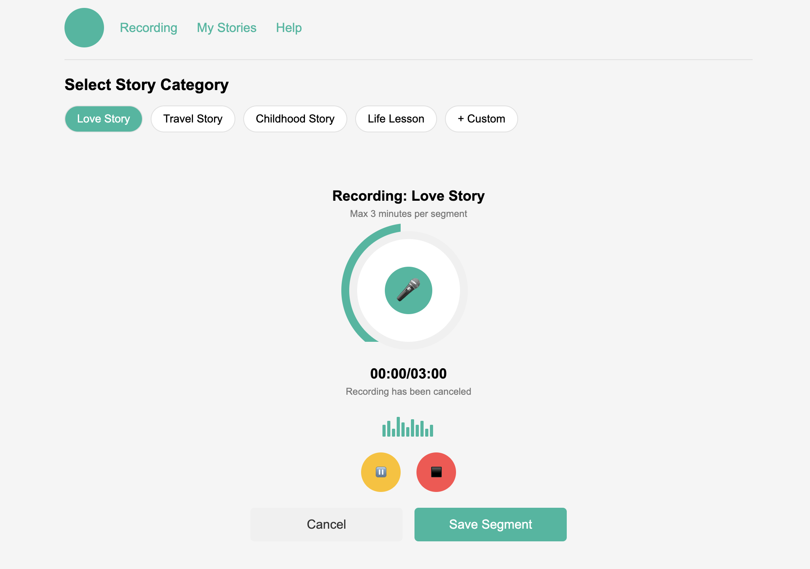
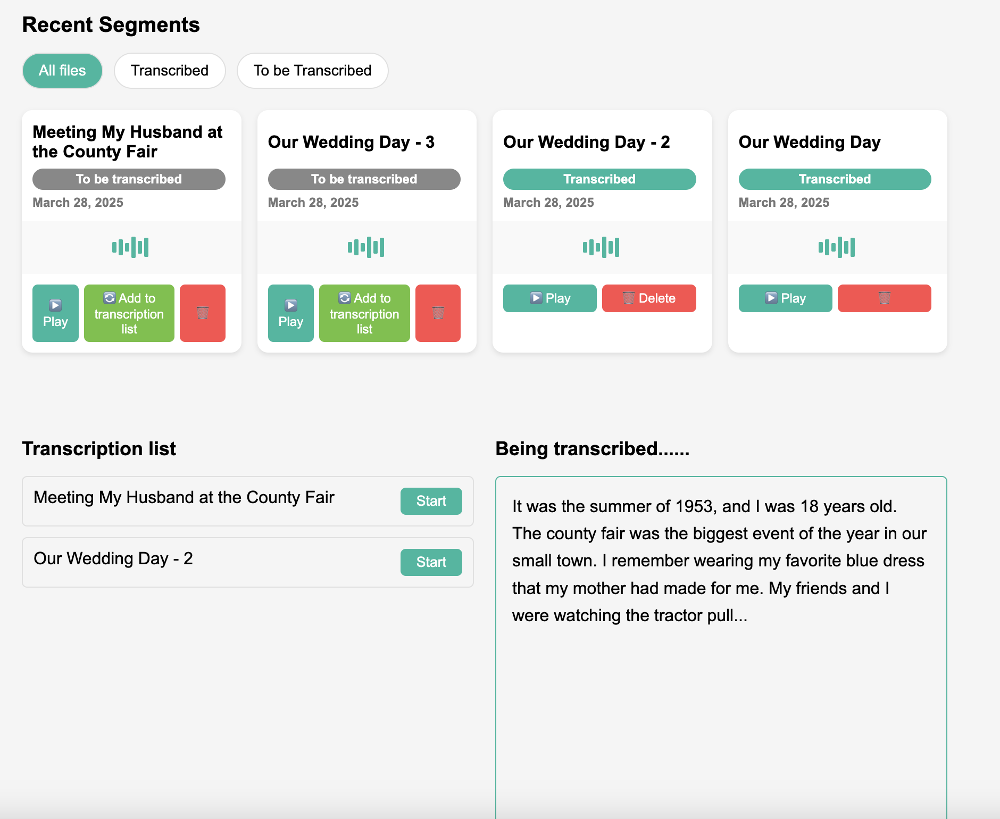

# Interface-demo

# Assisted Living Center Voice Story Sharing System

A voice-to-text platform that helps new residents of assisted living centers share their life stories.

## Project Overview

This system allows elderly users to share their life stories through a simple voice interface. The system transcribes the stories into text and selectively shares them with staff and family, supporting emotional care and personalized interaction.

## Technology Stack

- **Frontend**: Native JavaScript, HTML, CSS
- **Backend**: Node.js, Express, Multer (for file uploads), FFmpeg (for audio conversion)
- **API**: Hugging Face's Whisper-large-v3 speech recognition API

## Key Features

- Record voice stories using the browser's microphone
- Send recorded audio to the server
- Convert WebM format to WAV format on the server
- Use the Whisper-large-v3 model for speech recognition
- Display recognition results on the page

## Input Interface

- A *Start Recording* button
- Capture audio files using the microphone recording feature in the web page

## Output Interface

- Clear area to display transcribed text
- Success message: "*Conversion complete!*"
- Display the results of speech-to-text conversion

## Data Flow

1. Users record audio through the browser
2. The frontend sends WebM format audio to the backend
3. The backend uses FFmpeg to convert to WAV format
4. The backend sends the audio to the Hugging Face API
5. Receive recognition results and return them to the frontend
6. The frontend displays the transcribed text and provides management options

## Installation and Usage

1. Clone the repository
2. Install dependencies: `npm install`
3. Start the server: `npm start`
4. Access via browser: `http://localhost:3000`

